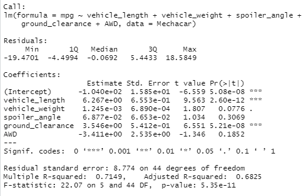
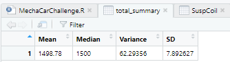
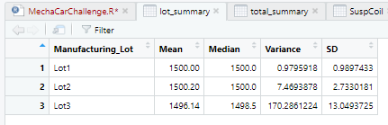
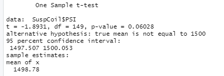
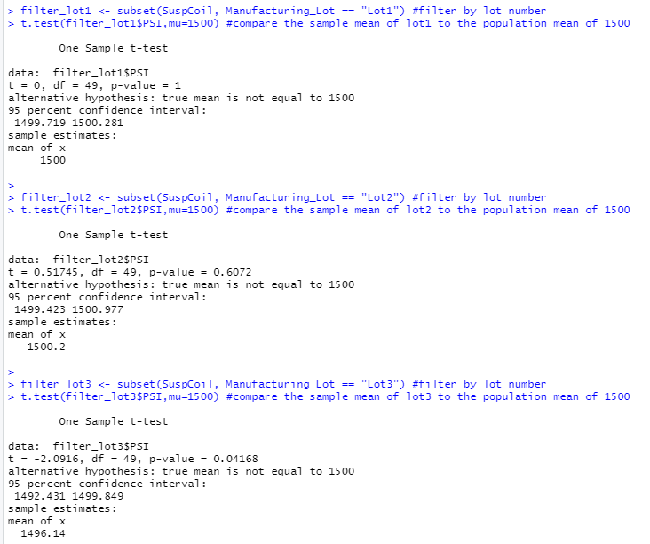

# MechaCar_Statistical_Analysis

## Linear Regression to Predict MPG

The following table of coefficients was obtained from a multiple linear regression analysis using miles per gallon as the dependent variable and vehicle length, vehicle weight, spoiler angle, ground clearance and AWD as indpendent variables:

Dependent variables for which the Pr(>|t|) value was significant and therefore are predicted to contribute a non-random amount of variance to the mpg value are: Vehicle length and ground clearance.  The y-intercept coefficient was also predicted to contribute a non-random amount of variance to the mpg value.

The slopes associated with two of the dependent variables are considered not to be zero: vehicle_length and ground_clearance.  For the remainder of the dependent variables, there is not enough evidence to state that the slopes (coefficients) are different from zero.

The linear model can only predict the correct mpg of MechaCar prototypes for 68.25% of the cases, because the adjusted R-squared value, computed only from the variables whose addition in the model are significant is 0.6825.  

## Summary Statistics on Suspension Coils

The mean, median, variance and standard deviation of the PSI for all manufacturing lots was calculated using the following Rscript:

`total_summary <- SuspCoil %>% summarize(Mean=mean(PSI), Median=median(PSI), Variance=var(PSI), SD=sd(PSI), .groups = 'keep') #create summary table`

and the results were:

the same values calculated per manufacturing lot were obtained the using the following Rscript line:

`lot_summary <- SuspCoil %>% group_by(Manufacturing_Lot) %>% summarize(Mean=mean(PSI), Median=median(PSI), Variance=var(PSI), SD=sd(PSI), .groups = 'keep') #create summary table`

and the results were:

Since the design specificantions for the MechaCar suspension coils dictate that the variance of the suspension coils must not exceed 100 pouds per square inch, the analysis shows that:
1) when considering all lots in total the manufacturing data shows that the design specification was met because the variance was calculated to be 62.29356,
2) however when the variance is calculated per lot, the analysis shows that manufacturing lot 3 did not meet the design specification because the calculated variance was 170.28.
3) the same per lot analysis shows that lots 1 and 2 met the design specifications.

## T-Tests on Suspension Coils

A one tail t-test was ran to compare the mean PSI for a sample of all suspension coils to the mean population PSI of 1500 using the following Rscript:

`t.test(SuspCoil$PSI,mu=1500) #compare the sample mean of all lots to the population mean of 1500`

the results are:

Since the calculated p-value of 0.06028 is great than the significant level of 0.05, we can not reject the null hypothesis that the sample mean is equal to the population mean of 1500.

When performing the same analysis on a per lot basis using the following Rscript:

`filter_lot1 <- subset(SuspCoil, Manufacturing_Lot == "Lot1") #filter by lot number
t.test(filter_lot1$PSI,mu=1500) #compare the sample mean of lot1 to the population mean of 1500`

`filter_lot2 <- subset(SuspCoil, Manufacturing_Lot == "Lot2") #filter by lot number
t.test(filter_lot2$PSI,mu=1500) #compare the sample mean of lot2 to the population mean of 1500`

`filter_lot3 <- subset(SuspCoil, Manufacturing_Lot == "Lot3") #filter by lot number
t.test(filter_lot3$PSI,mu=1500) #compare the sample mean of lot3 to the population mean of 1500`

we obtain the following results:

Because for manufacturing lot 1 and lot 2 the p-value is greater than 0.05 (1.0 for Lot 1 and 0.6072 for Lot2), we can not reject the null hypothesis that the sample mean is equal to the population mean of 1500.

However, because the p-value for lot 3 analysis is smaller than 0.05 (0.04168), we can reject the null hypothesis that the sample mean is equal from the population mean of 1500.

## Study Design: MechaCar vs Competition

To quantify how the MechaCar performs against the competition I would want to consider one metric:  ratio of mpg to price (mpg/price).

The reason for my choice is that many buyers already know, depending on the car that they are looking for what is the mpg for that type car (e.g. sports car low mpg, economy high mpg).  Therefore, if we bring price into the equation we can provide a measure of what is the price per mpg - a lower price for the same mpg means that the vehicle is more attractive to the consummer.

The null hypothesis is that is there is no difference between the mean mpg/price ratio for MechaCars and that for the competitor.

The alternative hypothesis is that there is a difference between the mean mpg/price ratio for MechaCars and that for the competitor.

To test the hypothesis I would use a two-tail test because I want to compare the means of two populations.

To run the statistical test I would need to know the mpg and the price for each car manufactured by MechaCar and the competitior.

